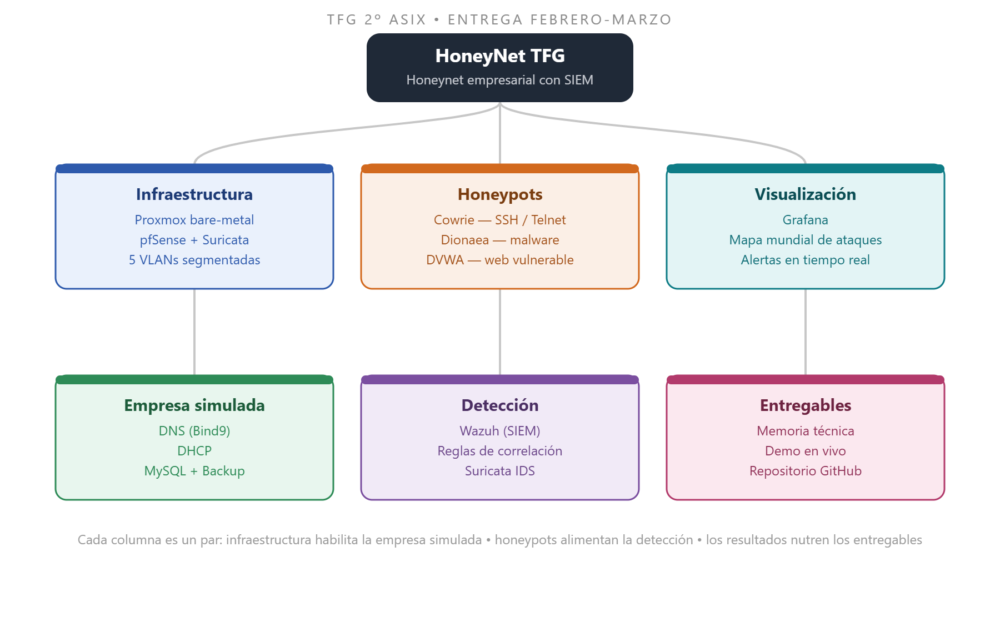

# Ideas Principales

## Ideas



### **Concepto central**

* Red de empresa simulada + señuelos (honeypots) que atraen ataques reales de internet
* No es solo tener honeypots sino cerrar el círculo completo:&#x20;

```
detectar → analizar → responder → visualizar
```



### **Infraestructura base**

* Proxmox como servidor de virtualización
* pfSense + Suricata como cerebro de red: firewall, router y IDS a la vez
* Segmentación en VLANs



### **Los señuelos (HoneyPots)**

* Cowrie → ataques SSH/Telnet (fuerza bruta, sesiones interactivas)
* Dionaea → malware
* DVWA → ataques web

<details>

<summary><em>¿Cómo funciona cada HoneyPot?</em></summary>

**Cowrie**: Escucha en los puertos 22 y 23. El atacante cree que se conecta a un servidor real. Graba **todo**: IP, usuario/contraseña probados, comandos ejecutados, archivos descargados.

**Dionaea**: Cubre puertos que Cowrie no toca: SMB (445), FTP (21), MySQL (3306). Su objetivo específico es **capturar el malware en sí**.

**DVWA:** Es una aplicación web insegura a SQL injection, ataques de fuerza bruta. Aquí no capturas "malware" sino técnicas de explotación web.

</details>



### **Empresa simulada**

* DNS, DHCP, MySQL, Backup → dan credibilidad de infraestructura real
* VM de usuarios → contexto de empleados



### Inteligencia y respuesta

* Wazuh centraliza todos los logs (SIEM)



### Riesgos a vigilar

* Alcance grande para el tiempo disponible, sobre todo trabajando solo
* Hardware



<figure><figcaption></figcaption></figure>

